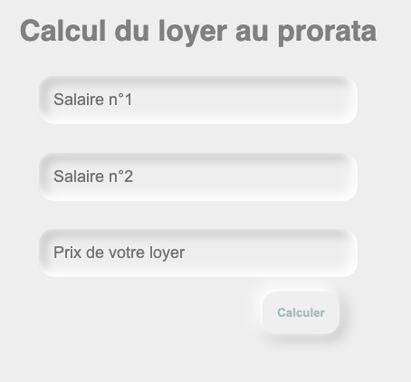

# Prorata, une calculatrice pratique

Prorata effectue un calcul précieux pour connaitre la juste répartition du coût du loyer entre 2 colocataires.

En projet : pouvoir ajouter plus de deux colocataires.

 
